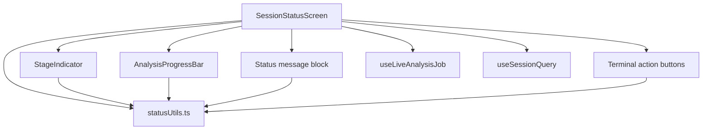

# Design Document — Loading Screen Progress

## Overview

This design replaces the minimal `SessionStatusScreen` with a visually engaging, real-time progress experience. The screen tracks the analysis pipeline through four user-visible stages (`uploading → queued → processing → completed / failed`) and communicates progress via a `StageIndicator` component, an `AnalysisProgressBar` component, contextual status messaging, and terminal-state action buttons.

Status is driven by a live Firestore subscription via the existing `useLiveAnalysisJob` hook, with a fallback to the `useSessionQuery` result. All pure mapping logic (status → percentage, status → node states, status → messages) is extracted into standalone utility functions so it can be unit- and property-tested independently of the React component tree.

---

## Architecture



`SessionStatusScreen` owns all data fetching and derives a single `activeStatus: SessionStatus` value. It passes that value (and the error message string for the `failed` case) down to the two new presentational components and renders the message block and action buttons inline.

The two new components (`StageIndicator`, `AnalysisProgressBar`) are purely presentational — they receive props and have no data-fetching logic of their own.

All mapping logic lives in `src/components/status/statusUtils.ts` and is exported as named pure functions. This keeps the components thin and makes the correctness properties directly testable.

---

## Components and Interfaces

### New files

| Path | Purpose |
|---|---|
| `src/components/status/StageIndicator.tsx` | Horizontal step-node row |
| `src/components/status/AnalysisProgressBar.tsx` | Animated fill bar |
| `src/components/status/statusUtils.ts` | Pure mapping utilities |
| `src/components/status/index.ts` | Barrel export |

### Modified files

| Path | Change |
|---|---|
| `src/screens/main/SessionStatusScreen.tsx` | Full replacement of body |

---

### `statusUtils.ts`

All functions are pure (no side effects, no hooks) and exported as named exports.

```ts
import { SessionStatus } from '../../types/analysis';

// ── Stage ordering ──────────────────────────────────────────────────────────

/** The four user-visible pipeline stages in order. */
export const PIPELINE_STAGES = ['uploading', 'queued', 'processing', 'completed'] as const;
export type PipelineStage = (typeof PIPELINE_STAGES)[number];

// ── Node state ──────────────────────────────────────────────────────────────

export type NodeState = 'pending' | 'active' | 'completed' | 'error';

export interface StageNodeConfig {
  stage: PipelineStage;
  label: string;
  state: NodeState;
}

/**
 * Derives the state of every stage node from the active SessionStatus.
 *
 * Rules:
 *  - Nodes before the active stage index → 'completed'
 *  - Node at the active stage index      → 'active' (or 'error' when status is 'failed')
 *  - Nodes after the active stage index  → 'pending'
 *  - 'draft' is treated the same as 'uploading' (first stage)
 */
export function getStageNodes(status: SessionStatus): StageNodeConfig[] { ... }

// ── Progress percentage ─────────────────────────────────────────────────────

const STAGE_PERCENTAGES: Record<PipelineStage | 'failed', number> = {
  uploading:  25,
  queued:     50,
  processing: 75,
  completed:  100,
  failed:     0,   // resolved to last known percentage at call site
};

/**
 * Returns the target fill percentage [0, 100] for the given status.
 * For 'failed', returns the percentage of the stage at which failure occurred
 * (passed in as lastKnownPercentage, defaulting to 0).
 */
export function getProgressPercentage(
  status: SessionStatus,
  lastKnownPercentage?: number,
): number { ... }

// ── Status messages ─────────────────────────────────────────────────────────

export interface StatusMessage {
  title: string;
  body: string;
}

/**
 * Returns the title and body message for the given status.
 * For 'failed', errorMessage is used as the body when provided;
 * falls back to a generic string.
 */
export function getStatusMessage(
  status: SessionStatus,
  errorMessage?: string | null,
): StatusMessage { ... }

// ── Accessibility label ─────────────────────────────────────────────────────

/**
 * Returns the accessibilityLabel string for the progress bar.
 * Format: "<Stage label>, <percentage>% complete"
 * Example: "Processing, 75% complete"
 */
export function getProgressAccessibilityLabel(
  status: SessionStatus,
  percentage: number,
): string { ... }

// ── Terminal state helpers ──────────────────────────────────────────────────

export function isTerminalStatus(status: SessionStatus): boolean {
  return status === 'completed' || status === 'failed';
}

export function isActiveStatus(status: SessionStatus): boolean {
  return status === 'uploading' || status === 'queued' || status === 'processing';
}
```

---

### `StageIndicator`

```ts
export interface StageIndicatorProps {
  status: SessionStatus;
}
```

Renders a horizontal row of four `StageNode` sub-components connected by thin lines. Each node receives its `NodeState` from `getStageNodes(status)`.

**Node visual mapping:**

| NodeState | Icon (MaterialCommunityIcons) | Color |
|---|---|---|
| `pending` | `circle-outline` | `colors.gray400` |
| `active` | `circle-slice-8` (pulse animation) | `colors.primary` |
| `completed` | `check-circle` | `colors.success` |
| `error` | `close-circle` | `colors.error` |

The connector line between two adjacent nodes is rendered in `colors.success` when the left node is `completed`, otherwise `colors.gray600`.

Labels are rendered below each node using `scaleFont(11)` in `colors.textSecondary`, switching to `colors.textPrimary` for the active node.

The `active` node plays a looping scale pulse using `withRepeat(withSequence(withTiming(1.15, {duration: 600}), withTiming(1.0, {duration: 600})), -1)` on a `useSharedValue(1)`.

---

### `AnalysisProgressBar`

```ts
export interface AnalysisProgressBarProps {
  status: SessionStatus;
  /** Passed through so the bar can hold its position on failure */
  lastKnownPercentage?: number;
}
```

**Layout:** A full-width track (`colors.gray700`, height `scaleHeight(8)`, border-radius `proportionalSize(4)`) containing a fill view whose width is driven by a Reanimated shared value.

**Width animation:**
```ts
const fillPercent = useSharedValue(0);

useEffect(() => {
  const target = getProgressPercentage(status, lastKnownPercentage);
  fillPercent.value = withTiming(target, { duration: 600, easing: Easing.out(Easing.cubic) });
}, [status]);

const animatedFillStyle = useAnimatedStyle(() => ({
  width: `${fillPercent.value}%`,
}));
```

**Shimmer during `processing`:**
A second `useSharedValue` drives an opacity oscillation (`withRepeat(withSequence(withTiming(0.4, {duration: 800}), withTiming(1.0, {duration: 800})), -1, true)`) applied to a white overlay view on top of the fill. The shimmer is only active when `status === 'processing'`; it is cancelled via `cancelAnimation` when the status changes.

**Error state:** When `status === 'failed'`, the fill color switches to `colors.error` and all animations are cancelled.

**Accessibility:**
```tsx
<Animated.View
  accessibilityRole="progressbar"
  accessibilityLabel={getProgressAccessibilityLabel(status, fillPercent.value)}
  accessibilityValue={{ min: 0, max: 100, now: fillPercent.value }}
  ...
/>
```

---

### Updated `SessionStatusScreen`

The screen retains its existing data-fetching logic and adds:

1. Derives `activeStatus` and `errorMessage` from job/session data.
2. Renders `StageIndicator` and `AnalysisProgressBar` inside the panel.
3. Renders the title (with `accessibilityLiveRegion="polite"`) and body from `getStatusMessage`.
4. Conditionally renders terminal action buttons.

```tsx
const status = job?.status ?? session?.status ?? 'queued';
const errorMessage =
  job?.errorMessage ?? session?.errorMessage ?? 'The backend could not process this clip.';

// Firestore subscription error overrides everything
const displayStatus: SessionStatus = firestoreError ? 'failed' : status;
const displayError = firestoreError
  ? 'Could not reach the server. Check your connection.'
  : errorMessage;
```

---

## Data Models

No new Firestore documents or types are introduced. The feature consumes existing types from `src/types/analysis.ts`.

### Derived view model (internal to `SessionStatusScreen`)

```ts
interface StatusScreenViewModel {
  activeStatus: SessionStatus;
  errorMessage: string;
  stageNodes: StageNodeConfig[];       // from getStageNodes()
  progressPercentage: number;          // from getProgressPercentage()
  statusMessage: StatusMessage;        // from getStatusMessage()
  showViewResults: boolean;            // activeStatus === 'completed'
  showTryAgain: boolean;               // activeStatus === 'failed'
}
```

This is not a formal type exported from the module — it documents the shape of the values computed inline in the screen component.

### Status message map

| SessionStatus | Title | Body |
|---|---|---|
| `uploading` | "Uploading clip" | "Sending your video to Firebase Storage…" |
| `queued` | "In the queue" | "Your clip is waiting for the analysis worker." |
| `processing` | "Analyzing motion" | "MediaPipe Pose is extracting landmarks and computing your scores." |
| `completed` | "Analysis ready" | "Your motion breakdown is ready to review." |
| `failed` | "Analysis failed" | `job.errorMessage ?? session.errorMessage ?? "The backend could not process this clip."` |
| `draft` | "Preparing upload" | "Getting your session ready…" |

### Stage-to-percentage map

| SessionStatus | Target % |
|---|---|
| `uploading` | 25 |
| `queued` | 50 |
| `processing` | 75 |
| `completed` | 100 |
| `failed` | last known % (frozen) |
| `draft` | 0 |

---

## Correctness Properties

*A property is a characteristic or behavior that should hold true across all valid executions of a system — essentially, a formal statement about what the system should do. Properties serve as the bridge between human-readable specifications and machine-verifiable correctness guarantees.*

The pure utility functions in `statusUtils.ts` are the primary targets for property-based testing. They have no side effects, accept typed inputs, and return typed outputs — ideal for PBT.

**Property reflection:** After reviewing all testable criteria, properties 1.2–1.6 (node state per status) are all instances of the same mapping invariant and are consolidated into Property 1. Properties 3.1 and 3.6 (message non-emptiness and error fallback) are related but test different aspects — 3.1 tests all statuses, 3.6 tests the specific fallback chain for `failed` — so they are kept separate. Properties 4.3 and 4.4 test complementary aspects of terminal action visibility and are kept separate.

---

### Property 1: Stage node states are mutually consistent with status

*For any* valid `SessionStatus`, the array returned by `getStageNodes(status)` must satisfy all of the following invariants simultaneously:
- Exactly one node has state `active` or `error` (never both, never zero for non-terminal statuses; for `completed` all are `completed`).
- All nodes before the active/error node have state `completed`.
- All nodes after the active/error node have state `pending`.
- When `status === 'completed'`, all four nodes have state `completed`.
- When `status === 'failed'`, exactly one node has state `error` and no node has state `active`.
- The array always contains exactly four elements.

**Validates: Requirements 1.2, 1.3, 1.4, 1.5, 1.6**

---

### Property 2: Progress percentage is always in [0, 100]

*For any* valid `SessionStatus` and any `lastKnownPercentage` in [0, 100], the value returned by `getProgressPercentage(status, lastKnownPercentage)` must be a finite number in the closed interval [0, 100].

**Validates: Requirements 2.3**

---

### Property 3: Status message always has a non-empty title and body

*For any* valid `SessionStatus` and any nullable `errorMessage` string, the object returned by `getStatusMessage(status, errorMessage)` must have a non-empty `title` string and a non-empty `body` string.

**Validates: Requirements 3.1, 3.2, 3.3, 3.4, 3.5**

---

### Property 4: Failed error message fallback chain always produces a non-empty string

*For any* combination of nullable `jobErrorMessage` and nullable `sessionErrorMessage`, the resolved error body for `status === 'failed'` must be a non-empty string (the generic fallback ensures this is always satisfied).

**Validates: Requirements 3.6**

---

### Property 5: Terminal actions only appear in terminal states

*For any* non-terminal `SessionStatus` (`uploading`, `queued`, `processing`, `draft`), `isTerminalStatus(status)` must return `false`, and the screen must not render "View Results" or "Try Again" buttons.

*For any* terminal `SessionStatus` (`completed`, `failed`), `isTerminalStatus(status)` must return `true`.

**Validates: Requirements 4.3, 4.4**

---

### Property 6: Status derivation always produces a valid SessionStatus

*For any* combination of nullable `job` (with a `status` field) and nullable `session` (with a `status` field), the expression `job?.status ?? session?.status ?? 'queued'` must always resolve to a value that is a member of the `SessionStatus` union type.

**Validates: Requirements 5.3**

---

### Property 7: Node visuals always include both a color and an icon

*For any* `NodeState` value (`pending`, `active`, `completed`, `error`), the visual configuration for that node must include both a non-null icon name (from `MaterialCommunityIcons`) and a non-null color key (from the `Colors` interface), ensuring color is never the sole differentiator.

**Validates: Requirements 6.2**

---

### Property 8: Progress bar accessibility label always contains stage name and percentage

*For any* valid `SessionStatus` and any `percentage` in [0, 100], the string returned by `getProgressAccessibilityLabel(status, percentage)` must be non-empty and must contain both a human-readable stage name and a numeric percentage value.

**Validates: Requirements 6.3**

---

## Error Handling

| Error condition | Trigger | Behaviour |
|---|---|---|
| Firestore subscription error | `useLiveAnalysisJob` returns non-null `error` | `displayStatus` forced to `'failed'`; `displayError` set to "Could not reach the server. Check your connection." |
| `jobId` absent and `session.latestJobId` null | Both params null | `useLiveAnalysisJob` receives `undefined`; hook returns `{ job: null, error: null }`; status falls back to `session?.status ?? 'queued'` |
| `session` query loading | `useSessionQuery` returns `isLoading: true` | Screen renders with `status = 'queued'` (safe default) until data arrives |
| Both `job` and `session` null | Extreme edge case | `status = 'queued'`; no crash |
| `errorMessage` null on `failed` | Backend did not populate field | Falls back to generic string "The backend could not process this clip." |

---

## Testing Strategy

### Unit tests (example-based)

Located in `src/components/status/__tests__/statusUtils.test.ts`.

- Verify each specific status → title mapping (Requirements 3.2–3.5)
- Verify `completed` status → all nodes completed (Requirement 1.5)
- Verify `failed` status → one error node, rest pending (Requirement 1.6)
- Verify `getProgressPercentage` returns exact values for each named stage (Requirement 2.3)
- Verify `isTerminalStatus` returns correct boolean for each status
- Verify `getProgressAccessibilityLabel` format for a concrete example
- Verify Firestore error overrides status to `failed` with connection message (Requirement 5.4)
- Verify `accessibilityLiveRegion="polite"` is set on the title element (Requirement 6.4)

### Property-based tests

Located in `src/components/status/__tests__/statusUtils.property.test.ts`.

Uses **fast-check** (already available in the JS ecosystem; add as a dev dependency: `yarn add --dev fast-check`). Each test runs a minimum of 100 iterations.

```ts
// Tag format: Feature: loading-screen-progress, Property N: <property text>

// Property 1: Stage node states are mutually consistent with status
fc.assert(fc.property(fc.constantFrom(...ALL_STATUSES), (status) => {
  const nodes = getStageNodes(status);
  // assert invariants...
}), { numRuns: 100 });

// Property 2: Progress percentage is always in [0, 100]
fc.assert(fc.property(
  fc.constantFrom(...ALL_STATUSES),
  fc.float({ min: 0, max: 100 }),
  (status, lastKnown) => {
    const pct = getProgressPercentage(status, lastKnown);
    return pct >= 0 && pct <= 100 && Number.isFinite(pct);
  }
), { numRuns: 100 });

// Property 3: Status message always has non-empty title and body
fc.assert(fc.property(
  fc.constantFrom(...ALL_STATUSES),
  fc.option(fc.string(), { nil: null }),
  (status, errorMsg) => {
    const msg = getStatusMessage(status, errorMsg);
    return msg.title.length > 0 && msg.body.length > 0;
  }
), { numRuns: 100 });

// Property 4: Failed error fallback always non-empty
fc.assert(fc.property(
  fc.option(fc.string({ minLength: 1 }), { nil: null }),
  fc.option(fc.string({ minLength: 1 }), { nil: null }),
  (jobErr, sessionErr) => {
    const msg = getStatusMessage('failed', jobErr ?? sessionErr);
    return msg.body.length > 0;
  }
), { numRuns: 100 });

// Property 5: Terminal actions only appear in terminal states
fc.assert(fc.property(fc.constantFrom(...ALL_STATUSES), (status) => {
  const terminal = isTerminalStatus(status);
  return (status === 'completed' || status === 'failed') === terminal;
}), { numRuns: 100 });

// Property 6: Status derivation always produces a valid SessionStatus
fc.assert(fc.property(
  fc.option(fc.constantFrom(...ALL_STATUSES), { nil: null }),
  fc.option(fc.constantFrom(...ALL_STATUSES), { nil: null }),
  (jobStatus, sessionStatus) => {
    const derived = jobStatus ?? sessionStatus ?? 'queued';
    return ALL_STATUSES.includes(derived as SessionStatus);
  }
), { numRuns: 100 });

// Property 7: Node visuals always include both color and icon
fc.assert(fc.property(fc.constantFrom(...NODE_STATES), (nodeState) => {
  const visuals = getNodeVisuals(nodeState);
  return visuals.iconName != null && visuals.colorKey != null;
}), { numRuns: 100 });

// Property 8: Accessibility label contains stage name and percentage
fc.assert(fc.property(
  fc.constantFrom(...ALL_STATUSES),
  fc.float({ min: 0, max: 100 }),
  (status, pct) => {
    const label = getProgressAccessibilityLabel(status, pct);
    return label.length > 0 && /\d+/.test(label);
  }
), { numRuns: 100 });
```

### Integration tests

- Render `SessionStatusScreen` with a mocked `useLiveAnalysisJob` returning each status in sequence; assert `StageIndicator` and `AnalysisProgressBar` update correctly (Requirement 5.2).
- Render with `useLiveAnalysisJob` returning an error; assert connection error message is shown (Requirement 5.4).
- Verify the Firestore unsubscribe function is called on unmount (Requirement 5.5).

### Visual / manual tests

- Shimmer animation during `processing` state (Requirement 2.4).
- 600 ms transition timing on status change (Requirement 2.2).
- Pulse animation on active stage node.
- Dark mode, high contrast, and color blind mode rendering (Requirement 6.1).
